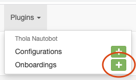
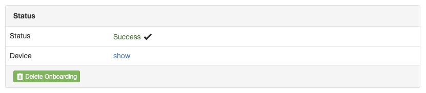

# Thola Nautobot
The Integration of [Thola](https://github.com/inexio/thola) into [Nautobot](https://github.com/nautobot/nautobot)

Thola is a unified interface for communication with network devices. You can use it to retrieve live information of your network devices, independent of their vendor, type or model.

## Installation

The first thing you need is a running Thola API. Checkout Thola's [main repository](https://github.com/inexio/thola) to get information on how to install and start a Thola API.

Once this is done, we can install the Nautobot plugin for Thola.
You need to install thola-nautobot in the same python environment as your running nautobot instance.

Download and install the plugin using:

```
$ pip3 install thola-nautobot
```

Add thola-nautobot to your local requirements in the `NAUTOBOT_ROOT` directory.

```
$ echo thola-nautobot >> $NAUTOBOT_ROOT/local_requirements.txt
```

In your `nautobot_config.py`, add thola-nautobot to the `PLUGINS` list. Here you can also define special configuration parameters.

```python
PLUGINS = ["thola_nautobot"]

PLUGINS_CONFIG = {
  "thola_nautobot": {
    # ADD YOUR PARAMETERS HERE
  }
}
```

Next, run the database migrations.

```
$ nautobot-server migrate
```

Finally, restart the WSGI service to load the new plugin.

```
$ sudo systemctl restart nautobot nautobot-worker
```

That's it! Now you are ready to use Thola 🎉

## Usage

We now want to monitor our first device with Thola. To get started, we create a Thola configuration on that device. Open the device's detail view and search for the Thola panel. Click on `Enable`.


Thola mainly uses SNMP for communication. Therefore, you need to enter the SNMP credentials for your device. In case you rely on the default credentials, just leave these fields empty.

Once you click on `Create`, the Thola API you started before will connect to your device. So make sure to have the API running now.

If successful, you find an overview over all components that you can monitor on the given device. This depends on the type of device.


Now you can inspect the live status of your device by clicking on the `Live Status` tab. This shows the status of all available components for your device.

## Onboarding

Thola can be used to identify new devices and automatically add them to Nautobot. All you need is SNMP access to the device. Thola will then create a new device with the corresponding type and manufacturer.

Now we create our first onboarding task. In your navigation bar, go to `Plugins` and then look for `Thola Nautobot` / `Onboardings`. Click on the `+` to create a new onboarding task.



Here you can specify the IP address of the device that you want to add to Nautobot as well as the SNMP credentials. Also you need to select the site and a role for the device.

By clicking on `Create`, you add the onboarding task to a queue. Thola_nautobot uses Nautobot's rqworker to process the tasks. Normally this doesn't take too long so refresh the page a few times.



Once the task was successful, you can easily delete it. We onboarded our first device with Thola.


As you can see, Thola identified the manufacturer and model of the device and set the device type accordingly. There is no need to create a type or vendor in advance since Thola automatically does this for you.
Furthermore, Thola assigned a name based on the device's serial number or IP. However, if you want to name the devices by hand you can disable that feature.

## Plugin Config

As stated before nautobot has a config file, where plugin parameters can be set:

```python
PLUGINS_CONFIG = {
  "thola_nautobot": {
    # ADD YOUR PARAMETERS HERE
  }
}
```

For thola_nautbot all parameters are optional. If a parameter is not set, the plugin will just use the default values.

| Parameter | Description | Type | Default value
|---|---|---|---|
| `thola_api` | Default Address and port of a running thola API | String | `"http://localhost:8237"` |
| `snmp_community` | Default SNMP community for a device | String | `"public"` |
| `snmp_version` | Default SNMP version for a device| String | `"2c"` |
| `snmp_port` | Default SNMP port for a device | Integer | `161` |
| `snmp_discover_par_requests` | Default amount of parallel connection requests used while trying to get a valid SNMP connection | Integer | `5` |
| `snmp_discover_timeout` | Default timeout in seconds used while trying to get a valid SNMP connection | Integer | `2` |
| `snmp_discover_retries` | Default number of retries used while trying to get a valid SNMP connection | Integer | `0` |
| `onboarding_create_models` | If true, Thola will create device types and manufacturers for onboarded devices | Boolean | `True` |
| `onboarding_device_name` | If true, Thola will automatically add names to onboarded devices | Boolean | `True` |

## API

The plugin comes with several API endpoints.

| Method | Route | Description |
|---|---|---|
| `GET` | `/plugins/thola_nautobot/config` | Returns list of all Thola configurations |
| `POST` | `/plugins/thola_nautobot/config` | Creates a new Thola configuration |
| `GET` | `/plugins/thola_nautobot/config/{id}` | Returns details of a given configuration |
| `PUT` | `/plugins/thola_nautobot/config/{id}` | Updates a given Thola configuration |
| `DELETE` | `/plugins/thola_nautobot/config/{id}` | Deletes a given Thola configuration |
| `GET` | `/plugins/thola_nautobot/config/{id}/livedata` | Returns available live data for a given Thola device |
| `GET` | `/plugins/thola_nautobot/onboarding` | Returns list of all Thola onboarding tasks |
| `POST` | `/plugins/thola_nautobot/onboarding` | Creates a new Thola onboarding task |
| `GET` | `/plugins/thola_nautobot/onboarding/{id}` | Returns details of a given onboarding task |
| `PUT` | `/plugins/thola_nautobot/onboarding/{id}` | Updates a given Thola onboarding task |
| `DELETE` | `/plugins/thola_nautobot/onboarding/{id}` | Deletes a given Thola onboarding task |
| `GET` | `/plugins/thola_nautobot/onboarding/{id}/onboard` | Queue a run for a given onboarding task |

## Any questions?

Feel free to look at the [main repository](https://github.com/inexio/thola) of Thola. Also, checkout our [website](https://thola.io).

### Missing a device?

If you run a device that Thola doesn't support yet, check out our [documentation](https://docs.thola.io/adding-device/writing-device-classes/). There you find a full explanation on how to add a new device type into Thola. We are happy to see your contributions!